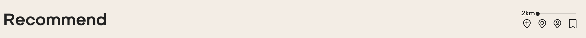

<!-- 

## About Laravel

Laravel is a web application framework with expressive, elegant syntax. We believe development must be an enjoyable and creative experience to be truly fulfilling. Laravel takes the pain out of development by easing common tasks used in many web projects, such as:

- [Simple, fast routing engine](https://laravel.com/docs/routing).
- [Powerful dependency injection container](https://laravel.com/docs/container).
- Multiple back-ends for [session](https://laravel.com/docs/session) and [cache](https://laravel.com/docs/cache) storage.
- Expressive, intuitive [database ORM](https://laravel.com/docs/eloquent).
- Database agnostic [schema migrations](https://laravel.com/docs/migrations).
- [Robust background job processing](https://laravel.com/docs/queues).
- [Real-time event broadcasting](https://laravel.com/docs/broadcasting).

Laravel is accessible, powerful, and provides tools required for large, robust applications.

## Learning Laravel

Laravel has the most extensive and thorough [documentation](https://laravel.com/docs) and video tutorial library of all modern web application frameworks, making it a breeze to get started with the framework.

You may also try the [Laravel Bootcamp](https://bootcamp.laravel.com), where you will be guided through building a modern Laravel application from scratch.

If you don't feel like reading, [Laracasts](https://laracasts.com) can help. Laracasts contains over 2000 video tutorials on a range of topics including Laravel, modern PHP, unit testing, and JavaScript. Boost your skills by digging into our comprehensive video library.

## Laravel Sponsors

We would like to extend our thanks to the following sponsors for funding Laravel development. If you are interested in becoming a sponsor, please visit the Laravel [Patreon page](https://patreon.com/taylorotwell).

### Premium Partners

- **[Vehikl](https://vehikl.com/)**
- **[Tighten Co.](https://tighten.co)**
- **[Kirschbaum Development Group](https://kirschbaumdevelopment.com)**
- **[64 Robots](https://64robots.com)**
- **[Cubet Techno Labs](https://cubettech.com)**
- **[Cyber-Duck](https://cyber-duck.co.uk)**
- **[Many](https://www.many.co.uk)**
- **[Webdock, Fast VPS Hosting](https://www.webdock.io/en)**
- **[DevSquad](https://devsquad.com)**
- **[Curotec](https://www.curotec.com/services/technologies/laravel/)**
- **[OP.GG](https://op.gg)**
- **[WebReinvent](https://webreinvent.com/?utm_source=laravel&utm_medium=github&utm_campaign=patreon-sponsors)**
- **[Lendio](https://lendio.com)**

## Contributing

Thank you for considering contributing to the Laravel framework! The contribution guide can be found in the [Laravel documentation](https://laravel.com/docs/contributions).

## Code of Conduct

In order to ensure that the Laravel community is welcoming to all, please review and abide by the [Code of Conduct](https://laravel.com/docs/contributions#code-of-conduct).

## Security Vulnerabilities

If you discover a security vulnerability within Laravel, please send an e-mail to Taylor Otwell via [taylor@laravel.com](mailto:taylor@laravel.com). All security vulnerabilities will be promptly addressed.

## License

The Laravel framework is open-sourced software licensed under the [MIT license](https://opensource.org/licenses/MIT). -->

# Route8

Route8 は走行時の状態や移動手段なども合わせて経路を共有できるサイトです．

## 🚙 詳しい内容：Qiita

こちらに Route8 についての詳しい内容と技術的な部分をまとめています．

## 🚙 開発環境・使用技術・ツール

<H3>開発期間：2ヶ月</H3>

<H3>FE

<h3>BE
  
<h3>DB

<h3>インフラ

<h3>デプロイ

<h3>UI・ロゴ

## 🚙 アプリ機能

### 1. ログイン・新規登録機能

Route8 を利用するためのアカウント登録機能とログイン機能です． 
パスワードは忘れないように． 
ログアウトは画面右上のユーザーネームをクリックするとできます．

<!-- 

 画面詳細 
 -->

<!-- 
 -->

### 2. 経路表示・各アイコン

#### 経路表示

ログインした際に現れる画面がメイン画面となります． 
投稿されている経路がカード形式で表示されます． 
下書き保存した投稿は自身の投稿アイコンからアクセスできます． 

<!-- 

 画面詳細 
 -->

<!-- 
 -->

各投稿をクリックすると，より詳細な経路の情報を閲覧できます．

経路詳細画面の投稿者名をクリックするとそのユーザーが投稿した経路を表示できます．

#### 各アイコン

<table>
メイン画面
  <caption></caption>
  <tr>
    <td>経路作成</td>
    <td>自身の投稿表示(下書きを含む)</td>
    <td>リコメンド機能</td>
    <td>ブックマークリスト</td>
  </tr>
</table>

<table>
経路詳細画面(自身の投稿)
  <caption></caption>
  <tr>
    <td>メイン画面表示</td>
    <td>自身の投稿表示(下書きを含む)</td>
    <td>リコメンド機能</td>
    <td>投稿編集機能</td>
    <td>投稿削除ボタン</td>
    <td>投稿ブックマーク機能</td>
  </tr>
</table>
<table>
  <tr>
    <td>他ユーザーの投稿の場合は投稿編集機能と投稿削除ボタンは表示されません．
    </td>
  </tr>
</table>

<table>
メイン画面(カード)
  <caption></caption>
  <tr>
    <td>投稿編集機能</td>
    <td>投稿削除ボタン</td>
    <td>リコメンド機能</td>
  </tr>
</table>
<table>
  <tr>
    <td>他ユーザーの投稿の場合は投稿編集機能と投稿削除ボタンは表示されません．
    </td>
  </tr>
</table>

### 3. 経路作成・編集・削除

メイン画面の右上にある + ボタンをクリックします． 
各項目を入力，選択することで経路を共有準備をします． 
[Google Map]をクリックすると Google Map に遷移するので，経路を表示させた後 html 埋め込みタグをコピペしてください．(マップ上で経路を表示させていなくても投稿はできます．)

<!-- 

 画面詳細 
 -->

<!-- 
 -->

削除アイコンで投稿の削除ができます．

### 4. リコメンド機能

旗アイコンをクリックすると自身が最後に投稿した経路付近の投稿を表示します． 
右上のバーから 1km 単位，2~20km での範囲選択ができます． 
また，各経路詳細画面にて旗アイコンをクリックするとその経路に対してリコメンド機能が動作します．

### 5. チャット機能

投稿ごとにチャット機能を設けています． 
ユーザーとのコミュニケーションやより詳細な情報を聞き出したりと様々なことに利用可能です．投稿者がメッセージを送信した場合，線で囲われます．

### 6. 検索機能

経路の検索方法は二つあり，投稿の各アイコンをクリックするフィルター検索と，ヘッダー部分の検索バーでワード検索を実装しています．後者は，虫眼鏡アイコンをクリックすることで，検索項目を切り替えることが可能です．

#### フィルター検索

未走行アイコンは検索できません．

#### ワード検索

Title：投稿のタイトルで検索

Start：投稿のスタート地点で検索

Goal：投稿のゴール地点で検索

Body：投稿の内容で検索

### 7. ブックマーク機能

メイン画面，経路詳細画面のヘッダー部分のブックマークアイコンをクリックすることでブックマークされます． 
アイコンが塗りつぶされていればできています． 
ブックマークした経路はメイン画面からソートすることができます．

### 8. テーマ・エフェクト切り替え機能

フッターのアイコンからライトモードとダークモード，エフェクトを切り替えることができます． 
標準ではライトテーマ，エフェクト ON です． 
テーマ・エフェクトは保存されるのでどのデバイスでログインしても適応されます． 
お好みでどうぞ．

#### テーマ

ライトテーマ

ダークテーマ

#### エフェクト

エフェクト ON

エフェクト OFF

## 🚙 免責事項

この作成物および同梱物を使用したことによって生じたすべての障害・損害・不具合等に関しては，私と私の関係者および私の所属するいかなる団体・組織とも，一切の責任を負いません．各自の責任においてご使用ください．
